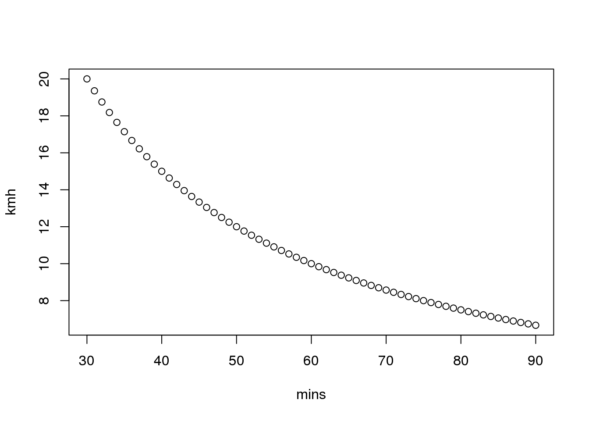
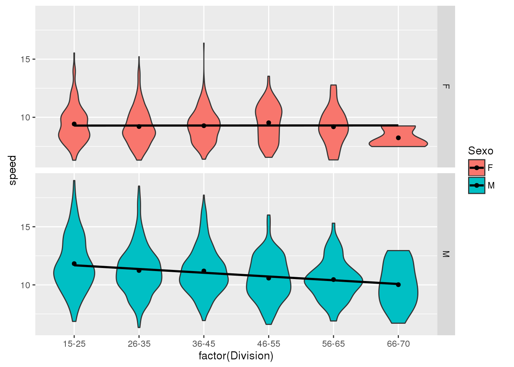
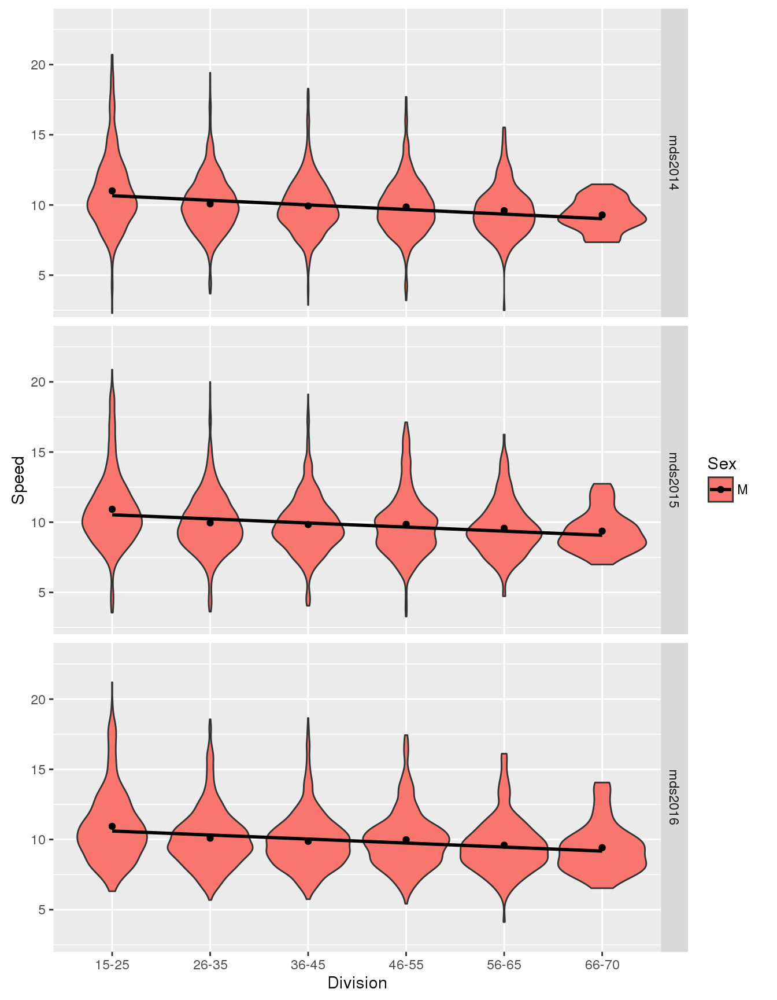

En este post voy a revisar el cambio de los tiempos en función de la edad.

Pero la variable a usar va a ser la velocidad, no el tiempo.
El problema con los tiempos es que no son lineales.

Por ejemplo esta es la relación entre los tiempos (en minutos) y la velocidad (km/h) en una carrera de 10km:


Para tiempos mayores que 60 minutos es bastante lineal, pero para tiempos menores definitivamente nó.

## Carrera Brooks 

Los datos son de la carrera [Brooks #50] [Brooks50]


Los tiempos de esta carrera por género (Sexo) se ven aquí:



La linea de tendencia ayuda a ver que en los hombres la velocidad (en km/h),
baja con la edad, que es lo esperado. Pero en las mujeres se aprecia una curva convexa, con valores altos en el rango 35-45 años.


Los valores de la pendiente son:

*  **-0.032** km/h por año para hombres, y
*  **0.000** km/h por año para mujeres

La cantidad de corredores:

```
##     Division
## Sexo 15-25 26-35 36-45 46-55 56-65 66-70
##    F   170   431   252   101    20     3
##    M   142   490   424   196    71    17
```

Mi impresión es que con la edad solo las mujeres más comprometidas quedan compitiendo. Eso se refleja en que la cantidad de participantes baja más rápido que en los hombres con la edad. Y esa "depuración" de participantes produce mejores resultados en las categorías del medio.
Pero eso será tema de otro artículo. 
Así que en el resto solo usaré los datos de los hombres.

## Otras carreras

Las otra carreras revisadas son las ediciones de [2014] [mds2014], [2015] [mds2015] y [2016] [mds2016] de la Corrida de Santiago (simultánea con la Maratón de Santiago). Esta es una carrera de 10k.


Los participantes (hombres) por categoría fueron:

```
##          Division
## event     15-25 26-35 36-45 46-55 56-65 66-70
##   mds2014   836  1456   922   489   197    31
##   mds2015   682  1167   796   463   202    42
##   mds2016   635  1047   771   452   203    41
```

Los resultados:

```
## $mds2014
##    Min. 1st Qu.  Median    Mean 3rd Qu.    Max. 
##   2.293   8.793   9.926  10.180  11.290  20.700 
## 
## $mds2015
##    Min. 1st Qu.  Median    Mean 3rd Qu.    Max. 
##   3.283   8.633   9.795  10.080  11.190  20.870 
## 
## $mds2016
##    Min. 1st Qu.  Median    Mean 3rd Qu.    Max. 
##   4.118   8.664   9.850  10.150  11.170  21.200
```

Distribuidos por categoría (Division):



Y la regresión lineal por edad dá los siguientes resultados:

```
##             mds2014 mds2015 mds2016
## (Intercept) 11.3562 11.1724 11.2527
## Age         -0.0337 -0.0307 -0.0305
```

Estos resultados son consistentes con los de la carrera Brooks #50.
Aunque en aquella no esta disponible la edad de cada participante y la regresión se hizo para la edad media de la categoría, y en el caso de MDS se hizo con la edad de cada participante.

## Otra distancia

Para chequear con otra distancia revisamos la media maratón de la MDS de los mismos años (2014,2015 y 2016).


Los participantes (hombres) por categoría fueron:

```
##          Division
## event     15-25 26-35 36-45 46-55 56-65 66-70
##   mds2014  1084  2582  2013  1036   319    26
##   mds2015   961  2698  2215  1210   401    38
##   mds2016   792  2564  2172  1196   429    38
```

Los resultados:

```
## $mds2014
##    Min. 1st Qu.  Median    Mean 3rd Qu.    Max. 
##    4.89    8.93    9.93   10.10   11.10   19.10 
## 
## $mds2015
##    Min. 1st Qu.  Median    Mean 3rd Qu.    Max. 
##    3.82    8.74    9.78    9.94   10.90   19.20 
## 
## $mds2016
##    Min. 1st Qu.  Median    Mean 3rd Qu.    Max. 
##    3.71    8.85    9.91   10.10   11.10   18.80
```

Distribuidos por categoría (Division):


Y la regresión lineal por edad dá los siguientes resultados:

```
##             mds2014 mds2015 mds2016
## (Intercept) 10.6885 10.6319 10.7061
## Age         -0.0164 -0.0187 -0.0174
```

Es llamativo que las velocidades medias son muy similares en las carreras de 10k y las de 21k.
La baja de velocidad con la edad es menos significativa en las carreras de 21k que de 10k, casi la mitad.

## Comentarios 
Lo esperable era una baja en la velocidad con la edad. Y se dá en hombres en carreras de 10k y 21k. 

En las mujeres ocurre algo distinto, con las categorías de 35 a 55 años teniendo los mejores resultados.
Eso requiere una explicación.

Por otra parte si observamos como cambian los máximos de cada categoría en los hombres, parece que la baja en la velocidad es mayor a la que indica la pendiente basada en la media.


### Impresión
Tengo la impresión de que la reducción de la velocidad con la edad es mayor que la que indica la regresión. Y que el efecto de auto selección efecto significativo. 
Es decir, en las catagorías mayores solo quedan los runners más dedicados, lo que sube su promedio, mientras que en los más jovenes participan más corredores con poca dedicación, que bajan el promedio.
Separar esa influencia requerirírá otro análisis.


[Brooks50]: <http://metachip.cl/?op=4&evento=243>
[mds2014]: <https://results.chronotrack.com/event/results/event/event-20591>
[mds2015]: <https://results.chronotrack.com/event/results/event/event-13311>
[mds2016]: <https://results.chronotrack.com/event/results/event/event-8069>


